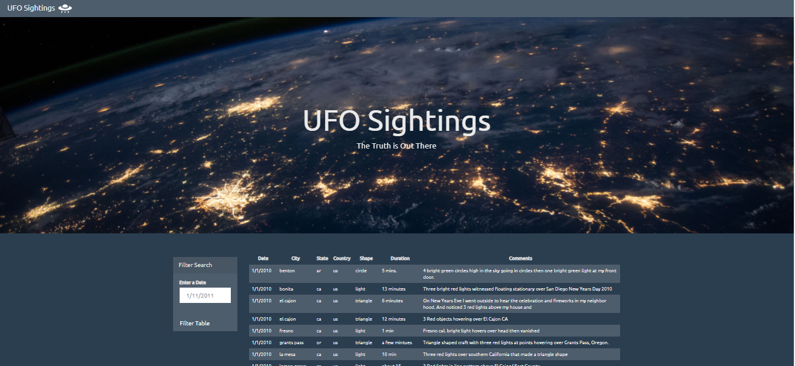
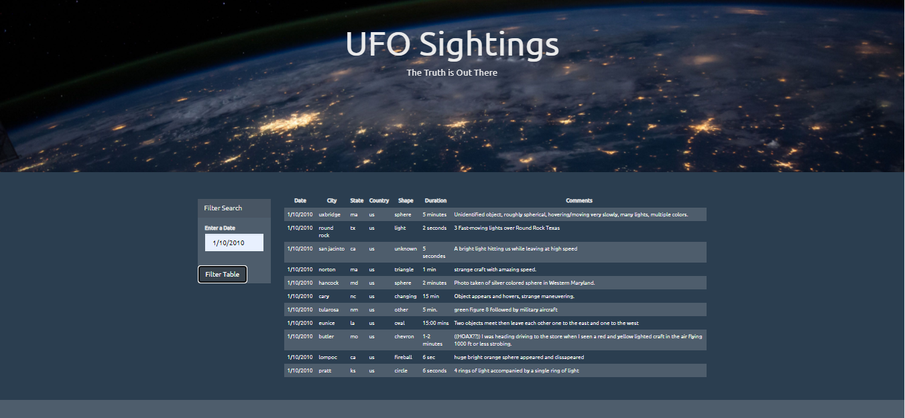
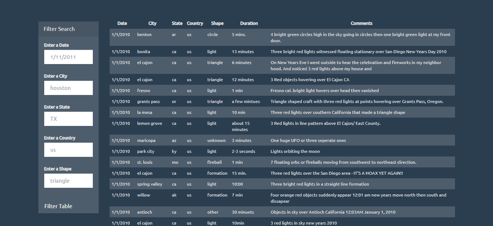
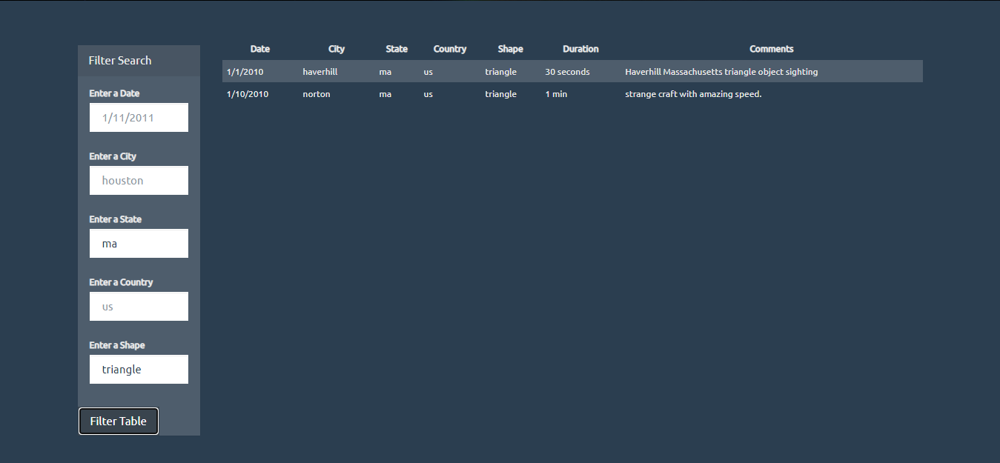

# javascript-challenge
In this challenge, all the UFO sighting of 2010 were collected in a [JSON dataset](./UFO-level-1/static/js/data.js). It is necessary to make them available online so that everybody is able to access them in an easy and filtrable way. \
They are displayed on the web-page by using Javascript, HTML and CSS. 
# [LEVEL 1](./UFO-level-1/)
In the folder [static](./UFO-level-1/static/), the [javascript code](./UFO-level-1/static/js/app.js) and the [javascript datased](./UFO-level-1/static/js/data.js) are reported in the folder [js](./UFO-level-1/static/js/) while the webpage style is in the file [style](./UFO-level-1/static/css/style.css) in the folder [css](./UFO-level-1/static/css/). \
The full dataset is displayed as the webpage is loaded and a place-holder is shown in the filtering bar: \
 \
Once a data is selected the table is uploaded to show all the sightings happened in the chosen date: \

# [LEVEL 2](./UFO-level-2/)
The [javascript code](./UFO-level-2/static/js/app.js) and the [javascript datased](./UFO-level-1/static/js/data.js) are in the folder [js](./UFO-level-2/static/js/) while the webpage style is in the file [style](./UFO-level-2/static/css/style.css) in the folder [css](./UFO-level-2/static/css/). \
The full dataset is displayed as the webpage is loaded and the filter criteria are expanded: \
 \
Example of filter results: \

